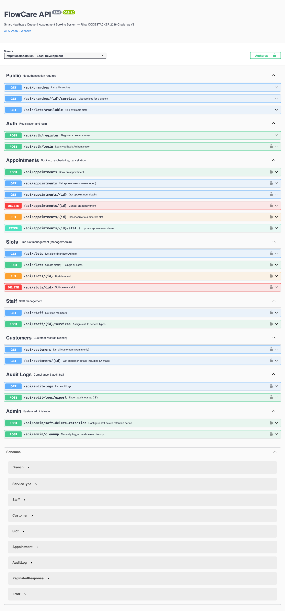
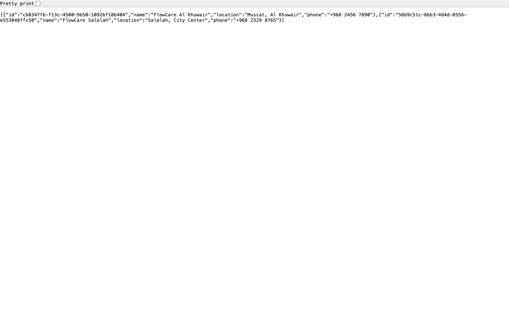

# FlowCare API - Smart Healthcare Queue Management

> **[View All Submissions - alizaabi.om/rihal-codestack](https://alizaabi.om/rihal-codestack/)**


**Live API:** [alizaabi.om/rihal-codestack/flowcare-api/health](https://alizaabi.om/rihal-codestack/flowcare-api/health) | **Swagger UI:** [alizaabi.om/.../api-docs](https://alizaabi.om/rihal-codestack/flowcare-api/api-docs/) | **Showcase:** [alizaabi.om/rihal-codestack/flowcare.html](https://alizaabi.om/rihal-codestack/flowcare.html)

---


A production-ready REST API for managing healthcare clinic queues, appointments, and staff — built for the **Rihal CODESTACKER 2026** competition.

---

## Screenshots

### Swagger UI — Interactive API Documentation (26+ Endpoints)



### Live API Response



### Showcase Page


---

## Features

- **26+ REST endpoints** covering the full appointment lifecycle
- **4-role RBAC** — Admin, Manager, Staff, Customer — with Basic Authentication
- **Interactive Swagger UI** — auto-generated OpenAPI 3.0 documentation at `/api-docs`
- **Queue management** — real-time queue position, status tracking, and slot-based scheduling
- **Slot management** with conflict detection to prevent double-booking
- **Audit logging** — every write operation logged with JSONB metadata, CSV export
- **Soft deletes on ALL entities** with configurable retention and cascading hard-delete cleanup
- **Multi-layer rate limiting** — global (100/15min), auth (20/15min), booking (10/hr), admin (50/15min)
- **File uploads** with type validation (JPEG/PNG for ID, +PDF for attachments) and size limits (2-5 MB)
- **Pagination & search** on all list endpoints with case-insensitive matching
- **Background scheduler** — daily 2 AM cron job for automatic cleanup
- **Idempotent seeding** — safe to run multiple times without duplicating data
- **2 seeded branches** — Al Khuwair (Muscat) and Salalah — with realistic demo data
- **8 data models** (7 core + 1 junction) for a complete healthcare domain
- **46 automated tests** — unit tests for services + integration tests for all endpoints
- **Live deployed** with Docker on production server

---

## Architecture

```
┌─────────────────────────────────────────────────────────────┐
│                      Client (curl / Postman / UI)           │
└──────────────────────────┬──────────────────────────────────┘
                           │ HTTP + Basic Auth
                           ▼
┌─────────────────────────────────────────────────────────────┐
│                      Express.js Server                      │
│  ┌──────────┐  ┌──────────┐  ┌──────────┐  ┌────────────┐  │
│  │Rate Limit│→ │  CORS    │→ │JSON Parse│→ │   Router   │  │
│  └──────────┘  └──────────┘  └──────────┘  └─────┬──────┘  │
│   (multi-tier)                                    │         │
│  ┌────────────────────────────────────────────────┼───────┐ │
│  │                  Middleware Pipeline            │       │ │
│  │  ┌────────────┐  ┌──────────┐  ┌────────────┐ │       │ │
│  │  │authenticate│→ │requireRole│→ │uploadFiles │ │       │ │
│  │  │(Basic Auth)│  │(RBAC)    │  │(Multer)    │ │       │ │
│  │  └────────────┘  └──────────┘  └────────────┘ │       │ │
│  └────────────────────────────────────────────────┘       │ │
│                           │                               │ │
│  ┌────────────────────────▼───────────────────────────────┐ │
│  │                   Route Handlers                       │ │
│  │  public │ auth │ appointments │ slots │ staff │ admin  │ │
│  └────────────────────────┬───────────────────────────────┘ │
│                           │                                 │
│  ┌────────────────────────▼───────────────────────────────┐ │
│  │                   Service Layer                        │ │
│  │  appointmentService │ slotService │ auditService       │ │
│  │  cleanupService (cron @ 2AM daily)                     │ │
│  └────────────────────────┬───────────────────────────────┘ │
└───────────────────────────┼─────────────────────────────────┘
                            │ Sequelize ORM
                            ▼
┌─────────────────────────────────────────────────────────────┐
│                   PostgreSQL 16                              │
│  branches │ service_types │ staff │ customers │ slots       │
│  appointments │ staff_services │ audit_logs                  │
│  ─── All entities support soft-delete (deletedAt) ───       │
└─────────────────────────────────────────────────────────────┘
```

### Request Flow: Booking an Appointment

```
Customer                    API                         Database
   │                         │                             │
   │  POST /api/appointments │                             │
   │  Authorization: Basic   │                             │
   │  { slotId, notes }      │                             │
   │────────────────────────▶│                             │
   │                         │  1. Decode Basic Auth       │
   │                         │  2. Verify bcrypt password  │
   │                         │  3. Check role = customer   │
   │                         │  4. Booking rate limit      │
   │                         │  5. Find slot               │
   │                         │─────────────────────────────▶
   │                         │  6. Check isBooked = false  │
   │                         │  7. Check deletedAt = null  │
   │                         │  8. App-level rate check    │
   │                         │◀─────────────────────────────
   │                         │  9. Create appointment      │
   │                         │ 10. Set slot.isBooked=true  │
   │                         │ 11. Log to audit_logs       │
   │                         │─────────────────────────────▶
   │                         │◀─────────────────────────────
   │  201 { appointment }    │                             │
   │◀────────────────────────│                             │
```

### Soft Delete Lifecycle

```
Entity created ──▶ Active ──▶ In use (referenced by other entities)
                        │
                  DELETE /entity/:id
                        │
                        ▼
              Soft-deleted (deletedAt set)
              Hidden from normal queries
              Admin can still view (?includeDeleted=true)
                        │
                  Retention period passes (default: 30 days)
                        │
                        ▼
              Hard-deleted by cleanup cron
              ├── Related records cascade-deleted
              └── Audit log entry preserved (immutable)

Applies to: branches, service_types, staff, customers, slots, appointments
```

---

## Tech Stack

| Layer | Technology | Why |
|---|---|---|
| Runtime | Node.js 18 | Fast async I/O, ideal for API servers |
| Framework | Express.js 4 | Minimal, flexible, widely adopted |
| Database | PostgreSQL 16 | JSONB for audit metadata, UUID support, ACID compliance |
| ORM | Sequelize 6 | Migration support, association management, query builder |
| Auth | Basic Authentication | Per the challenge specification |
| API Docs | Swagger UI (OpenAPI 3.0) | Interactive `/api-docs` endpoint |
| Testing | Jest + Supertest | Unit + integration tests, SQLite in-memory for CI |
| Containerization | Docker Compose | One-command setup, isolated environment |
| File Handling | Multer | Type/size validation, disk storage |
| Rate Limiting | express-rate-limit | Multi-tier per-endpoint throttling |
| Scheduling | node-cron | Daily cleanup automation |

---

## Testing

### Test Suite: 46 Tests (Unit + Integration)

```bash
npm test                 # Run all tests
npm run test:unit        # Unit tests only (services)
npm run test:integration # Integration tests only (API endpoints)
```

**Unit Tests** (`tests/unit/services.test.js`):
- CleanupService: retention logic, cascade delete, edge cases
- AuditService: pagination, CSV export, branch scoping

**Integration Tests** (`tests/integration/api.test.js`):
- Health check endpoint
- Public routes (branches, services, available slots)
- Auth routes (Basic Auth login, customer login, rejection)
- Appointment CRUD (book, cancel, reschedule, status update, double-booking prevention)
- Slot management (create, batch create, soft-delete, RBAC)
- Staff management (list, service assignment, access control)
- Customer routes (list, detail, password exclusion, RBAC)
- Audit log routes (view, CSV export, access control)
- Admin routes (retention config, cleanup trigger, RBAC)
- RBAC enforcement (admin full access, manager branch-scoped)
- Full soft-delete lifecycle (create → soft-delete → cleanup → verify)
- Swagger/OpenAPI spec validation

Tests use **SQLite in-memory** — no external database required. Zero-dependency CI.

---

## Rate Limiting

Multi-tier rate limiting protects against abuse:

| Tier | Limit | Window | Applied To |
|---|---|---|---|
| **Global** | 100 requests | 15 min | All endpoints |
| **Auth** | 20 requests | 15 min | `/api/auth/login`, `/api/auth/register` |
| **Booking** | 10 requests | 1 hour | `POST /api/appointments` |
| **Admin** | 50 requests | 15 min | `/api/admin/*` |
| **App-level** | 3 bookings | 1 hour | Per customer (in-service check) |

---

## API Documentation

### Interactive Swagger UI

After starting the server, visit **[http://localhost:3000/api-docs](http://localhost:3000/api-docs)** for the full interactive API documentation with:

- All 26+ endpoints grouped by domain
- Request/response schemas
- Try-it-out functionality with Basic Auth
- OpenAPI 3.0 spec available at `/api-docs.json`

### Endpoint Summary

| Method | Endpoint | Description | Auth |
|---|---|---|---|
| **Public** | | | |
| GET | `/api/branches` | List all branches | None |
| GET | `/api/branches/:id/services` | Services for a branch | None |
| GET | `/api/slots/available` | Find open slots (by branch, service, date) | None |
| GET | `/health` | Health check | None |
| **Auth** | | | |
| POST | `/api/auth/register` | Customer registration (with ID image upload) | None |
| POST | `/api/auth/login` | Login via Basic Auth | Basic |
| **Appointments** | | | |
| POST | `/api/appointments` | Book an appointment (optional attachment) | Customer |
| GET | `/api/appointments` | List appointments (role-scoped) | All |
| GET | `/api/appointments/:id` | Appointment details | All |
| PUT | `/api/appointments/:id` | Reschedule to different slot | Customer/Admin |
| DELETE | `/api/appointments/:id` | Cancel appointment | Customer/Admin |
| PATCH | `/api/appointments/:id/status` | Update status (checked-in/no-show/completed) | Staff+ |
| **Slots** | | | |
| GET | `/api/slots` | List slots (?includeDeleted for admin) | Manager/Admin |
| POST | `/api/slots` | Create slot(s) — single or batch | Manager/Admin |
| PUT | `/api/slots/:id` | Update a slot | Manager/Admin |
| DELETE | `/api/slots/:id` | Soft-delete a slot | Manager/Admin |
| **Staff** | | | |
| GET | `/api/staff` | List staff (branch-scoped for managers) | Manager/Admin |
| POST | `/api/staff/:id/services` | Assign staff to service types | Manager/Admin |
| **Customers** | | | |
| GET | `/api/customers` | List all customers | Admin |
| GET | `/api/customers/:id` | Customer details with ID image | Admin |
| **Audit Logs** | | | |
| GET | `/api/audit-logs` | View audit logs (branch-scoped for managers) | Manager/Admin |
| POST | `/api/audit-logs/export` | Export audit logs as CSV | Admin |
| **Admin** | | | |
| POST | `/api/admin/soft-delete-retention` | Configure retention period (days) | Admin |
| POST | `/api/admin/cleanup` | Trigger hard-delete cleanup | Admin |

---

## Data Models

> **Full schema documentation with ER diagram:** [SCHEMA.md](SCHEMA.md)

```
┌──────────┐     1:N     ┌──────────────┐
│ branches │─────────────│ service_types │
│ (soft-del│             │ (soft-delete) │
│          │──┐          └──────┬───────┘
└──────────┘  │                 │ M:N
              │                 │
              │  1:N    ┌───────┴────────┐
              ├─────────│     staff      │ (soft-delete)
              │         └───────┬────────┘
              │                 │ via staff_services
              │  1:N    ┌───────┴────────┐
              ├─────────│     slots      │ (soft-delete)
              │         └───────┬────────┘
              │                 │ 1:1
              │  1:N    ┌───────┴────────┐     1:N    ┌───────────┐
              └─────────│ appointments   │◀───────────│ customers │
                        │ (soft-delete)  │            │(soft-del) │
                        └────────────────┘            └───────────┘

              ┌────────────────┐
              │  audit_logs    │ ← immutable, tracks all write ops
              │  (JSONB meta)  │   NEVER deleted
              └────────────────┘
```

| Model | Key Fields | Soft Delete |
|---|---|---|
| **Branch** | name, location, phone | Yes |
| **ServiceType** | name, description, durationMinutes, price (OMR 3 decimals), branchId | Yes |
| **Staff** | name, email, role (admin/manager/staff), branchId | Yes |
| **Slot** | date, startTime, endTime, isBooked, branchId, serviceTypeId | Yes |
| **Customer** | name, email, phone, idImage (validated upload) | Yes |
| **Appointment** | status (booked/checked-in/no-show/completed/cancelled), notes, attachment | Yes |
| **StaffService** | staffId, serviceTypeId (M:N junction table) | No |
| **AuditLog** | action, actorId, actorRole, targetType, targetId, metadata (JSONB) | Immutable |

### Database Migrations

Version-controlled migration scripts in [`migrations/`](migrations/):

```bash
npm run migrate        # Run all migrations (up)
npm run migrate:down   # Rollback all migrations (down)
```

9 sequential migration files (001-009) with full DDL, foreign keys, indexes, and constraints.

---

## Project Structure

```
flowcare-be/
├── src/
│   ├── app.js                          # Express server + Swagger UI + cron
│   ├── config/
│   │   ├── config.js                   # Environment configuration
│   │   ├── database.js                 # Sequelize connection (PostgreSQL / SQLite for tests)
│   │   └── swagger.js                  # OpenAPI 3.0 specification
│   ├── models/
│   │   ├── index.js                    # Model registry + associations
│   │   ├── Branch.js, ServiceType.js   # Domain models (all with soft-delete)
│   │   ├── Staff.js, Customer.js       # User models (all with soft-delete)
│   │   ├── Slot.js, Appointment.js     # Booking models (all with soft-delete)
│   │   ├── AuditLog.js                 # Compliance model (immutable)
│   │   └── StaffService.js             # Junction table
│   ├── middleware/
│   │   ├── auth.js                     # Basic Authentication decoder
│   │   ├── roles.js                    # Role-based access control
│   │   ├── rateLimiter.js              # Multi-tier rate limiting (auth/booking/admin)
│   │   ├── audit.js                    # Audit logging helper
│   │   ├── upload.js                   # File upload validation (Multer)
│   │   └── errorHandler.js             # Global error handler
│   ├── routes/                         # Route handlers with Swagger annotations
│   │   ├── public.js, auth.js          # Public + auth routes
│   │   ├── appointments.js, slots.js   # Core booking routes
│   │   ├── staff.js, customers.js      # User management routes
│   │   └── auditLogs.js, admin.js      # Compliance + admin routes
│   ├── services/                       # Business logic layer
│   │   ├── appointmentService.js       # Booking, cancel, reschedule, queue
│   │   ├── slotService.js              # Slot CRUD + conflict detection
│   │   ├── auditService.js             # Log queries + CSV export
│   │   └── cleanupService.js           # Cascading hard-delete cleanup
│   └── seed/
│       ├── seed.js                     # Idempotent seeder (findOrCreate)
│       └── data.json                   # Seed data (JSON)
├── tests/
│   ├── setup.js                        # Test DB setup, seed helpers, auth utils
│   ├── unit/
│   │   └── services.test.js            # CleanupService + AuditService tests
│   └── integration/
│       └── api.test.js                 # Full API endpoint tests (46 tests)
├── migrations/                         # 9 versioned migration scripts
│   ├── 001-create-branches.js
│   ├── ...
│   ├── 009-add-soft-delete-all-entities.js
│   └── migrate.js                      # Migration runner (up/down)
├── SCHEMA.md                           # Full ER diagram + table definitions
├── jest.config.js                      # Test configuration
├── docker-compose.yml                  # PostgreSQL 16 + Node.js app
├── Dockerfile                          # Multi-stage Node.js build
└── package.json
```

---

## Quick Start

### Prerequisites
- Docker and Docker Compose installed

### Run locally

```bash
git clone https://github.com/zaabi1995/rihal-flowcare.git
cd rihal-flowcare
docker-compose up --build
```

The API will be available at `http://localhost:3000`.
Swagger docs at `http://localhost:3000/api-docs`.

Seed the database (in a separate terminal):

```bash
docker compose exec app npm run seed
```

### Run tests

```bash
npm install
npm test
```

No database required — tests use SQLite in-memory.

### Default credentials

| Role | Email / Username | Password |
|---|---|---|
| Admin | admin | admin123 |
| Manager | sara@flowcare.om | staff123 |
| Staff | rashid@flowcare.om | staff123 |
| Customer | ahmed@example.com | pass123 |

### Test it

```bash
# Health check
curl http://localhost:3000/health

# Login as admin
curl -X POST http://localhost:3000/api/auth/login \
  -H "Authorization: Basic $(echo -n 'admin:admin123' | base64)"

# List branches (public)
curl http://localhost:3000/api/branches
```

---

## Environment Variables

| Variable | Default | Description |
|---|---|---|
| `PORT` | `3000` | API port |
| `DB_HOST` | `db` | PostgreSQL host |
| `DB_PORT` | `5432` | PostgreSQL port |
| `DB_NAME` | `flowcare` | Database name |
| `DB_USER` | `flowcare` | Database user |
| `DB_PASSWORD` | `flowcare123` | Database password |
| `SOFT_DELETE_RETENTION_DAYS` | `30` | Days before hard-delete |
| `NODE_ENV` | `production` | Set to `test` for SQLite in-memory |

---

## API Usage Examples

### Booking Flow (Customer)

```bash
AUTH="Authorization: Basic $(echo -n 'ahmed@example.com:pass123' | base64)"

# 1. Browse branches
curl http://localhost:3000/api/branches

# 2. View services for a branch
curl http://localhost:3000/api/branches/{branchId}/services

# 3. Find available slots
curl "http://localhost:3000/api/slots/available?branchId={id}&serviceTypeId={id}&date=2026-03-20"

# 4. Book an appointment
curl -X POST http://localhost:3000/api/appointments \
  -H "$AUTH" -H "Content-Type: application/json" \
  -d '{"slotId": "slot-uuid", "notes": "First visit"}'

# 5. View my appointments
curl http://localhost:3000/api/appointments -H "$AUTH"

# 6. Reschedule
curl -X PUT http://localhost:3000/api/appointments/{id} \
  -H "$AUTH" -H "Content-Type: application/json" \
  -d '{"slotId": "new-slot-uuid"}'

# 7. Cancel
curl -X DELETE http://localhost:3000/api/appointments/{id} -H "$AUTH"
```

### Staff Workflow

```bash
AUTH="Authorization: Basic $(echo -n 'rashid@flowcare.om:staff123' | base64)"

# View my assigned appointments
curl http://localhost:3000/api/appointments -H "$AUTH"

# Check-in a patient
curl -X PATCH http://localhost:3000/api/appointments/{id}/status \
  -H "$AUTH" -H "Content-Type: application/json" \
  -d '{"status": "checked-in"}'

# Mark as completed
curl -X PATCH http://localhost:3000/api/appointments/{id}/status \
  -H "$AUTH" -H "Content-Type: application/json" \
  -d '{"status": "completed", "notes": "Follow-up in 2 weeks"}'
```

### Admin Operations

```bash
AUTH="Authorization: Basic $(echo -n 'admin:admin123' | base64)"

# Create slots (batch)
curl -X POST http://localhost:3000/api/slots \
  -H "$AUTH" -H "Content-Type: application/json" \
  -d '[{"branchId":"id","serviceTypeId":"id","date":"2026-03-20","startTime":"09:00","endTime":"09:30"},
       {"branchId":"id","serviceTypeId":"id","date":"2026-03-20","startTime":"10:00","endTime":"10:30"}]'

# Soft-delete a slot
curl -X DELETE http://localhost:3000/api/slots/{id} -H "$AUTH"

# View soft-deleted slots
curl "http://localhost:3000/api/slots?includeDeleted=true" -H "$AUTH"

# Assign staff to services
curl -X POST http://localhost:3000/api/staff/{staffId}/services \
  -H "$AUTH" -H "Content-Type: application/json" \
  -d '{"serviceTypeIds": ["service-uuid-1", "service-uuid-2"]}'

# View audit logs
curl http://localhost:3000/api/audit-logs -H "$AUTH"

# Export audit logs as CSV
curl -X POST http://localhost:3000/api/audit-logs/export -H "$AUTH" -o audit-logs.csv

# Configure retention period
curl -X POST http://localhost:3000/api/admin/soft-delete-retention \
  -H "$AUTH" -H "Content-Type: application/json" -d '{"days": 14}'

# Trigger cleanup
curl -X POST http://localhost:3000/api/admin/cleanup -H "$AUTH"
```

---

## Pagination & Search

All list endpoints support:
- `?page=1&pageSize=20` — pagination
- `?search=term` — case-insensitive search across relevant fields

```json
{
  "results": [...],
  "total": 42,
  "page": 1,
  "pageSize": 20
}
```

---

## Roles & Access Control

| Role | Scope | Key Permissions |
|---|---|---|
| **Admin** | System-wide | Full CRUD, audit logs, cleanup, retention config, all branches |
| **Manager** | Own branch | Manage slots & staff, view branch logs, update appointments |
| **Staff** | Own schedule | View assigned appointments, update status (check-in/complete/no-show) |
| **Customer** | Own data | Browse services, book/reschedule/cancel, view own history |

---

## Seed Data

The idempotent seed script (`npm run seed`) creates:
- **2 branches** — Al Khuwair (Muscat) + Salalah
- **4 service types** per branch — General, Dental, Eye Care, Lab Work
- **1 admin** + **6 staff** (1 manager + 2 staff per branch)
- **5 customers** with Omani names
- **12+ slots** across the next 5 days

Data file: [`src/seed/data.json`](src/seed/data.json)

---

## Design Decisions

| Decision | Rationale |
|---|---|
| **Basic Auth over JWT** | Challenge spec explicitly requires Basic Authentication |
| **Soft delete on ALL entities** | Comprehensive data retention — no accidental data loss |
| **Cascading hard-delete** | When slots are purged, related appointments are cleaned up; audit logs preserved |
| **Multi-tier rate limiting** | Auth brute-force protection (20/15min), booking hoarding prevention (10/hr) |
| **JSONB for audit metadata** | Flexible schema for different action types without schema migrations |
| **UUID primary keys** | Secure, distributed-safe, no sequential ID enumeration |
| **DECIMAL(10,3) for price** | Omani Rial uses 3 decimal places |
| **Layered architecture** | Routes → Services → Models separation for testability |
| **SQLite for tests** | Zero-dependency CI, no database setup required |
| **Idempotent seeding** | `findOrCreate()` ensures safe re-runs |

---

## Author

**Ali Al Zaabi**
Built for Rihal CODESTACKER 2026 — Challenge #2: Backend / Software Engineering

---

## Other Challenges
- [Visit Oman](https://github.com/zaabi1995/rihal-visit-oman) — Challenge #1: Frontend Development
- [DE Pipeline](https://github.com/zaabi1995/rihal-de-pipeline) — Challenge #4: Data Engineering
- [Muscat 2040](https://github.com/zaabi1995/rihal-muscat-2040) — Challenge #6: Data Analytics
